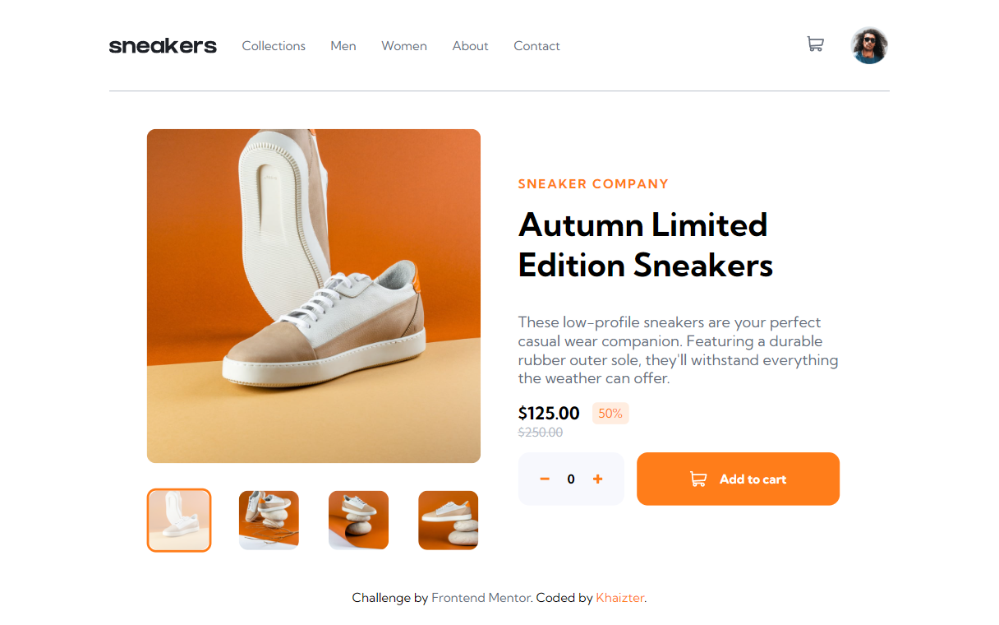
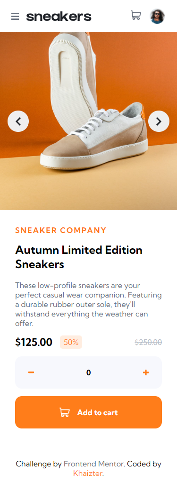

# Frontend Mentor - E-commerce product page solution

This is a solution to the [E-commerce product page challenge on Frontend Mentor](https://www.frontendmentor.io/challenges/ecommerce-product-page-UPsZ9MJp6). Frontend Mentor challenges help you improve your coding skills by building realistic projects.

## Table of contents

- [Overview](#overview)
  - [The challenge](#the-challenge)
  - [Screenshot](#screenshot)
  - [Links](#links)
- [My process](#my-process)
  - [Built with](#built-with)
  - [What I learned](#what-i-learned)
  - [Continued development](#continued-development)
  - [Useful resources](#useful-resources)
- [Author](#author)
- [Acknowledgments](#acknowledgments)

**Note: Delete this note and update the table of contents based on what sections you keep.**

## Overview

### The challenge

Users should be able to:

- View the optimal layout for the site depending on their device's screen size
- See hover states for all interactive elements on the page
- Open a lightbox gallery by clicking on the large product image
- Switch the large product image by clicking on the small thumbnail images
- Add items to the cart
- View the cart and remove items from it

### Screenshot

### Links

- Solution URL: [Github](https://github.com/khaizter/ecommerce-product-page)
- Live Site URL: [Github Page](https://khaizter.github.io/ecommerce-product-page)

## My process

### Built with

- Semantic HTML5 markup
- CSS custom properties
- Flexbox
- Mobile-first workflow
- [React](https://reactjs.org/) - Front End Framework
- [Block Element Modifier](http://getbem.com) - Classes Convention
- [Syntactically Awesome Style Sheets](https://sass-lang.com/) - CSS Preprocessor
- [React Transition Group](https://sass-lang.com/) - Animation Library

### What I learned

- React Hook useContext
- Reusable ImageSlider and Counter
- Basic React Transition Group Usage
- SVG Components

### Continued development

- I want to dive more about react hooks, state management, and also how to handle ui animations.

## Author

- Frontend Mentor - [@khaizter](https://www.frontendmentor.io/profile/khaizter)
- Github - [@khaizter](https://github.com/khaizter)
